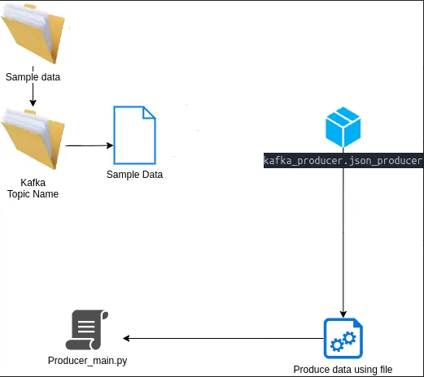

# confluent-kafka-Pipline 


this repo help us to know how to publish and consume data to end from kafka confluent in json format.


***
# High Level Architecture 🪢📈

***
How to setup confluent Kafka.
1. [Account Setup](Confluent%20Account.md)
2. [Cluster Setup](ConfluentClusterSetup.md)
3. [Kafka Topic](Confluent%20Topic%20Creation.md)
4. [Obtain secrets](Kafka%20key%20and%20secrets.md)
***
To use confluent kafka we need following details from Confluent dashboard.

```
confluentClusterName = ""
confluentBootstrapServers = ""
confluentTopicName = ""
confluentApiKey = ""
confluentSecret = ""
confluentSchemaApiKey = ""
confluentSchemaSecret = ""
endpoint = ""
```
***
## Tech Stack Used 

1. Python 
2. Bash
3. MongoDB
***
Step 1: Create a conda environment
```
conda --version
```

Step 2: Create a conda environment
```
conda create -p venv python==3.10 -y
```

step 3: 
```
conda activate venv/
```
Step 4:
```
pip install -r requirements.txt
```
